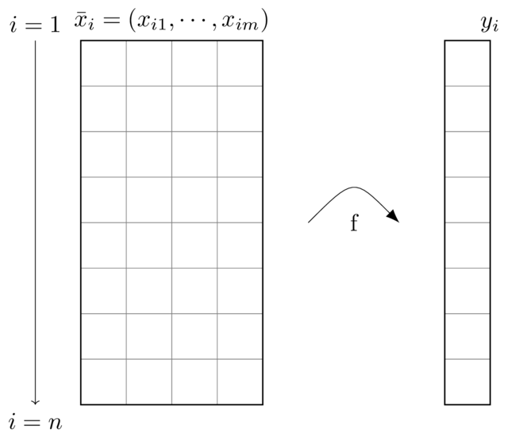
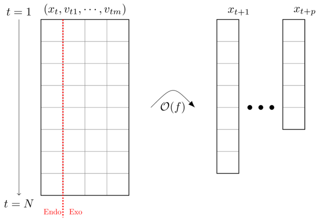

# Introducción a las series de tiempo

## Definición de las series de tiempo

Las series temporales son conjuntos de datos ordenados. El orden se da
en una dimensión que asociamos con la dimensión temporal. Otros tipos de
datos que también implican un ordenamiento son las imágenes (x, y),
las secuencias (texto), etc. En todos estos casos vemos que es
importante el lugar que el dato ocupa dentro del conjunto o
arreglo (indexado). Notamos que los registros de una serie temporal no
necesariamente deben estar separados por pasos de tiempo
regulares. Sin embargo, en estos casos, también se deben registrar los
intervalos de tiempo entre sucesivos valores.

Ejemplos frecuentes de series de tiempo: temperatura horaria o, en
general, registros meteorológicos y ambientales, precios de bienes,
acciones, bonos, etc., registros clínicos, logs de servidores,...

### Algunas diferencias de las series temporales con otros problemas de regresión

1. Las series temporales están indexadas por el tiempo y debe
preservarse dicho ordenamiento. Si se ignora este orden no solamente
se arriesgaría de entrenar al modelo con datos futuros sino se pierde
la información de contexto que ofrecen las observaciones anteriores.
2. La separación en datos de prueba y entrenamiento debe respetar el
orden por lo mencionado en el punto anterior. Por este motivo,
se recurre a técnicas de *windowing* o ventanas móviles.
Frecuentemente, se toma el 80% de datos al inicio y de manera
consecutiva para usar en entrenamiento. El resto se usará en prueba.
3. Las series de tiempo puede no tener atributos. Es posible
pronosticar series de tiempo sin el uso de otro atributo más que los
valores de la propia serie en los pasos anteriores.  
  a. Los valores de la propia serie en los pasos anteriores se
  consideran una variable de entrada endógena.  
  b. Si se cuenta con otros atributos que pueden ser de utilidad en el
  modelo para predecir los valores siguientes, entonces se dice que son
  variables exógenas. Muchas veces, una variable exógena puede ser un
  muy buen predictor de la serie temporal de interés. Más precisamente,
  una variable es exógena si es independiente de otras variables del sistema
  y la variable de salida depende de ella.  
  
### Comparación entre datos tabulares y series de tiempo

**Figura**: Ilustración de la relación entre las variables independientes (atributos) y la respuesta (target o variable dependiente) para datos tabulares.

En el aprenizaje estadístico para datos tabulares:
* No importa el orden.
  - Mezclamos para entrenar
* Una ecuación algebráica relaciona la respuesta con los atributos.
* Toda la información disponible está en los atributos de cada instancia.

Se propone hallar $f$ con modelos paramétricos y no-paramétricos.

**Figura**: Ilustración de la relación entre las variables exógenas y endógenas y la serie de tiempo que se busca predecir.

En el modelado de series de tiempo:
* Importa el orden
  - No mezclamos para entrenar
  - Armamos ventanas de datos
* Una ecuación diferencial relaciona la respuesta con los atributos.
* Incluímos estados anteriores
* El pasado puede contener información para predecir.

Se busca descubrir el operador temporal.

### Propiedades de las series temporales y los pronósticos

1. Las series se definen según la cantidad de variables que evolucionan
con el tiempo como:  
  a. Univariadas, una sola variable se observa o mide en función del tiempo.  
  b. Multivariadas, múltiples variables son observadas o medias en función del tiempo.  
2. Los pronósticos pueden ser:  
  a. De un paso (*single-step*), cuando se predice el valor de la
  variable de salida para el paso de tiempo siguiente.  
  b. Múltiples pasos (*multi-step*), cuando se  predice el valor de la
  variable de salida para más de un paso de tiempo en el futuro.  
3. Los procesos que representan las series temporales pueden ser:  
  a. Estáticos, es decir, una vez que se ajustó el modelo los parámetros
  permiten obtener sucesivos pronósticos.  
  b. Dinámicos, o que requieren recalibración para un nuevo pronóstco a medida que se prolonga la serie temporal.  
4. Las observaciones o registros pueden ser:  
  a. Contiguas o regulares, es decir, que se toman en intervalos de longitud uniforme en el tiempo.  
  b. Discontiguas o irregualres, cuando el paso de tiempo no es regular.  

### Principales áreas de aplicación del análisis de series temporales

* Pronósticos, es decir, predecir valores futuros de la serie conociendo el pasado. Ej, precios, demandas de bienes y servicios, etc.  
* Imputación, completar los datos faltantes de una serie temporal. Ej, rellenar faltantes de los registros de una estación meteorológica...
* Interpretación y causalidad (inferencia), es decir, comprender las interrelaciones entre las variables de entrada y las salidas... Derivar y evaluar relaciones causales.

