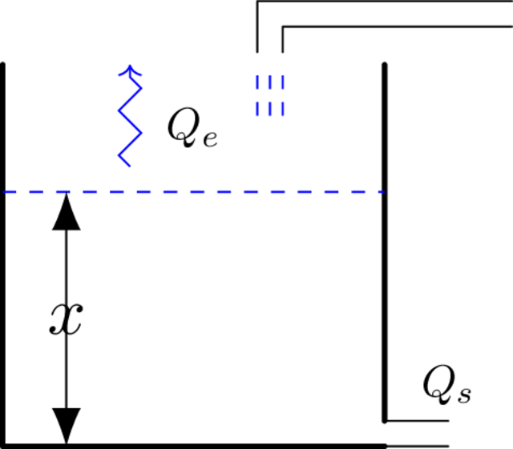
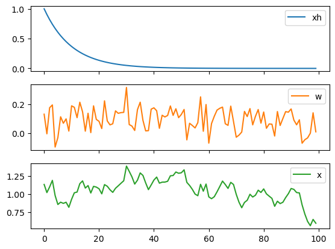
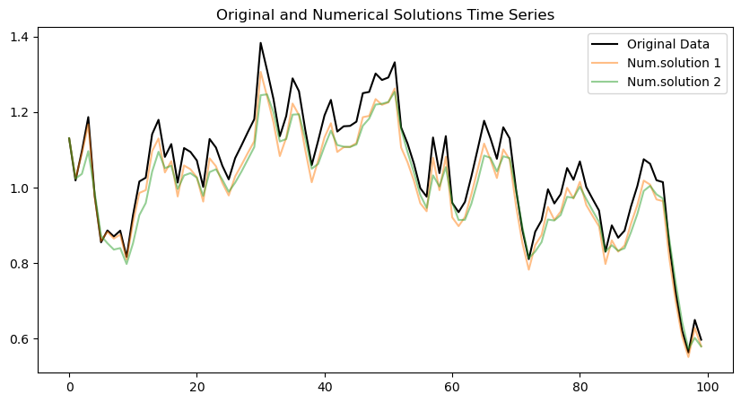
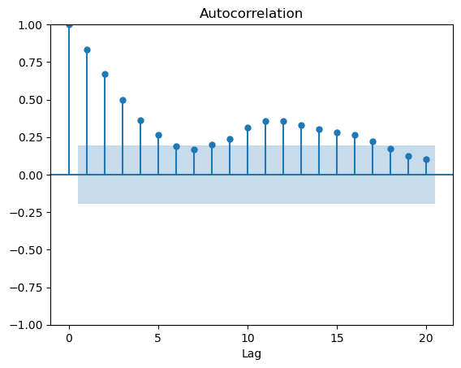
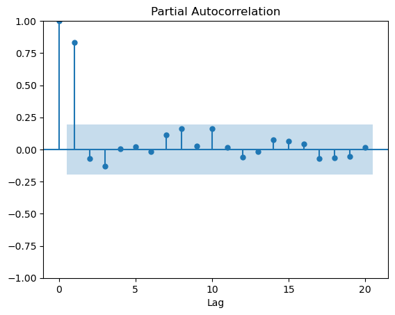
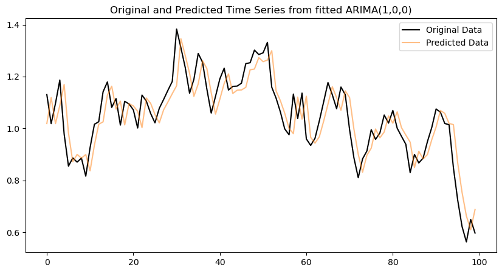
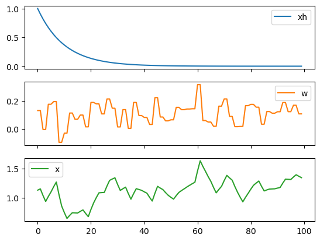
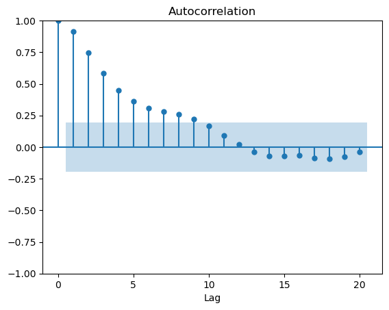
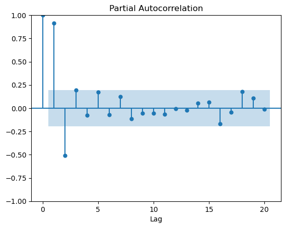

<!-- pandoc -t beamer --slide-level=2 text-05_interpretación.md -o text-05_interpretación.pdf --> 

# Esquema del proceso 

::: columns

:::: column

::::

:::: column
Características:

* $\frac{P}{R} = Q$

* $Q_e - Q_s = \frac{\Delta Vol}{\Delta t} = \mathrm{Area} \frac{\Delta x}{\Delta t}$

* $Q_s = \frac{\rho g}{R} x$

* $\frac{Q_e}{\mathrm{Area}} = \frac{dx}{dt} + \frac{\rho g}{\mathrm{Area}R} x$

* $w(t) = \frac{dx}{dt} + \alpha x$
::::

:::

## Solución numérica

$\frac{dx}{dt} \approx \left(x_t - x_{t-1}\right) \frac{1}{\Delta t}$ \,\,\,\, a *$1^{\mathrm{er}}$ orden*

$\frac{dx}{dt} \approx \left(\frac{3}{2} x_t - 2 x_{t-1} + \frac{1}{2} x_{t-2}\right) \frac{1}{\Delta t}$ \,\,\,\, a *$2^{\mathrm{do}}$ orden*

Por ejemplo

$w_t = x_t - x_{t-1} + \alpha x_t$ con $\Delta t=1$

$(1+\alpha) x_t = x_{t-1} + w_t$

$x_t = \alpha' x_{t-1} + w'_t$ es decir, luce como AR(1)

## Solución analítica

$x(t) = \exp \left(-\alpha t\right) \left(x_0 + \int_0^t w(t')\exp \left(\alpha t'\right) dt'\right)$

Si asumimos para $w(t)$ valores constantes entre, al menos,  el paso $t$ y el $t+1$ se tiene

$x_t = x_0 \exp(-\alpha t) + \frac{1-\exp(-\alpha)}{\alpha} \sum_{i=1}^t w_i \exp(-\alpha(t-i))$

## Representación de la solución analítica

::: columns

:::: column
* $total_time = 100$
* $\alpha = 0.1$
* $\mu=0.1$
* $\sigma=0.1$
* $w$ cambia en cada paso de tiempo
::::

:::: column
Características:

::::

:::

## Comparación solución analítica vs numérica

## Función de autocorrelación

## Función de autocorrelación parcial

Ajustando el modelo ARMA(p,q) a los datos para obtener el mejor AIC se obtiene
*p=1, q=0*.

::: columns

:::: column
Expresión del modelo AR(1) ajustado
$x_t = 0.8972 x_{t-1} +  w_t$
::::

:::: column
Expresión de la aprox. numérica de $1^{\mathrm{er}}$ orden
$x_t = 0.909 x_{t-1} + 0.909 w_t$
::::

:::

## Comparación de resultados

## Representación de la solución analítica

::: columns

:::: column
* $total_time = 100$
* $\alpha = 0.1$
* $\mu=0.1$
* $\sigma=0.1$
* $w$ cambia cada *2 paso* de tiempo
::::

:::: column
Características:

::::

:::

## Función de autocorrelación

## Función de autocorrelación parcial

Ajustando el modelo ARMA(p,q) a los datos para obtener el mejor AIC se obtiene
*p=1, q=1*.

Expresión del modelo ARMA(1,1) ajustado
$x_t = 0.8393 x_{t-1} + w_t + 0.9998 w_{t-1}$

## Comentarios finales

* El modelo AR(1) propuesto para describir los promedios de niveles  hidrométricos anuales de la estación Corrientes (guía 4) puede ser interpretado como un proceso gobernado por una ecuación diferencial de primer orden.
* Se puede plantear una analogía con el modelo de reservorio aquí visto:
  * La cuenca a la altura de la estación es vista de manera **agregada** como un reservorio.
  * Las lluvias, evapotranspiraciones y pérdidas por percolación se **agregan** y **anualizan**.
  * El balance resultante es el cuadal entrante y el **forzante** del modelo.
  * El comportamiento promedio de lluvias y pérdidas en general anualizas no estaría vinculado año a año (no hay componente de MA).
  * El forzante no es predecible. Entonces, es compatible con un ruido.
  