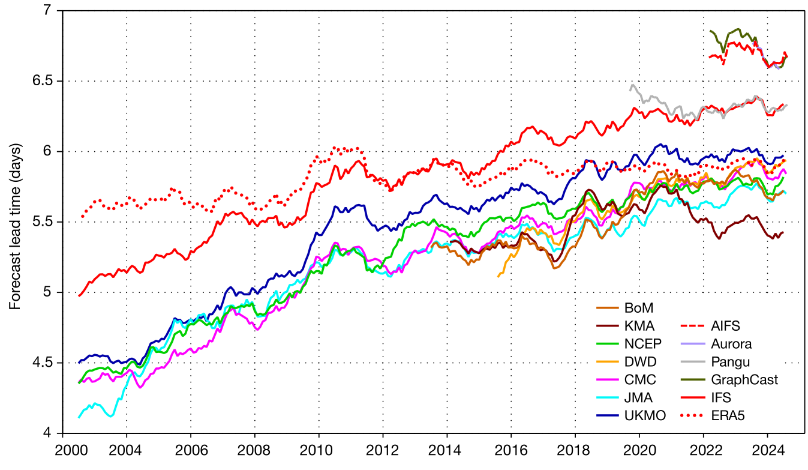
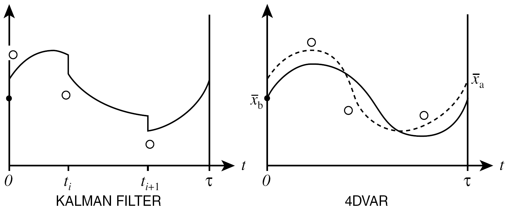
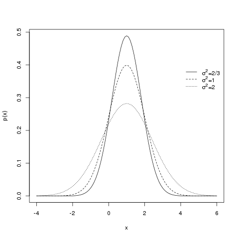
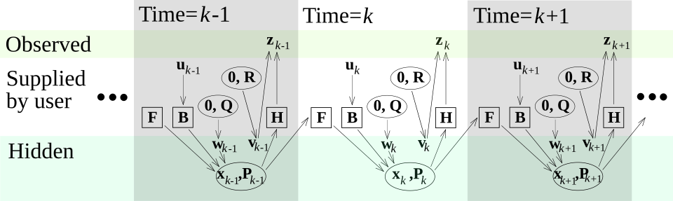
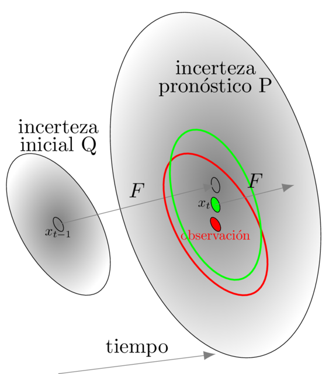
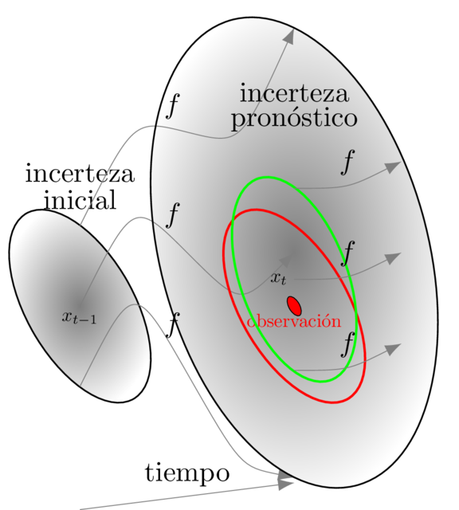

# Asimilación de datos y filtrado de Kalman

## Incertidumbre en las estimaciones

Las estimaciones siempre están afectadas por los errores de observación,
simplificación en la definición de los modelos, errores en la
determinación de parámetros, variabilidad natural de los fenómenos en el
espacio y el tiempo, incertidumbre inherente a los procesos.

Las aplicaciones basadas en modelos buscan acotar la incertidumbre e
inducir una reducción de los costos y riesgos a través de la reducción
de los errores de estimaciones y pronósticos.

## Asimilación de datos

Los métodos de asimilación de datos combinan el valor de las variables
de estado de un modelo con valores medidos u observados (como por
ejemplo, a través de teledetección) ponderados de manera estadística
óptima para alcanzar mejor estimaciones.

El error de la variable asimilada siempre es menor que el error
individual de cada fuente de datos.

<figure id="fig_ecmwf">

<figcaption> Cambios en la capacidad de predicción de varios modelos,
incluidos IFS, AIFS y ERA5 del ECMWF. La figura muestra el plazo en el
que la correlación de anomalías de la altura geopotencial de 500 hPa
sobre las zonas extratropicales del hemisferio norte cae por debajo del
85 %. Fuente:ECMWF</figcaption>
</figure>

Existen dos tendencias principales:

Métodos variacionales

:   los valores del vector de estado óptimo minimiza una función de
    costo (ej. Algoritmo de Levenberg-Marquardt).

    - Ajustado para vectores de estado de gran dimensión.

Filtros de Kalman

:   actúan como un algoritmo predictor-corrector.

    - Existen fórmulas explícitas para la ganacia óptima.

    - Existen filtros extendidos y por ensembles para modelos no
      lineales.

    - Se debe calcular una matriz inversa.

El filtro de Kalman efectúa un análisis en cada paso de tiempo. Los
variacionales analizan todas las observaciones simultáneamente dentro de
una ventana mayor.

<figure id="fig_comparaKFvsVar">

<figcaption> Ilustración del proceso de asimilación.</figcaption>
</figure>

### Asimilación de datos en las ciencias de la Tierra y el ambiente

Las técnicas de asimilación de datos se han difundido más allá de los
pronósticos numéricos del tiempo (NWF), en hidrología, agronomía, etc.

## Error cuadrático medio mínimo

En estadística y procesamiento de señal, un estimador de error
cuadrático medio mínimo (MMSE) es un método de estimación que minimiza
el error cuadrático medio (MSE), que es una medida común de la calidad
del estimador, de los valores ajustados de una variable dependiente. En
el entorno bayesiano, el término MMSE se refiere más específicamente a
la estimación con función de pérdida cuadrática. En tal caso, el
estimador MMSE está dado por la media posterior del parámetro a estimar.
Dado que la media posterior es difícil de calcular, la forma del
estimador MMSE generalmente se limita a estar dentro de una cierta clase
de funciones. Los estimadores MMSE lineales son una opción popular ya
que son fáciles de usar, calcular y muy versátiles. Ha dado lugar a
muchos estimadores populares, como el filtro Wiener-Kolmogorov y el
filtro Kalman.

### Función de densidad de probabilidad normal o gaussiana

Una variable aleatoria continua $X$ tiene una densidad $f_X$ si

$\Pr[a\leq X\leq b]=\int_{a}^{b} f_{X}(x)\,dx$.

Intuitivamente, se puede pensar que $f_X(x) dx$ como la probabilidad de
$X$ de estar en el intervalo $[x, x + dx]$.

La densidad de probabilidad normal definida como

$\frac{1}{\sqrt{2 \pi \sigma^2}} \exp^{-\frac{1}{2\sigma^2} \left( x - \mu \right)^2} \, dx$

cumple

$\Pr[-\infty \leq X \leq \infty]=1$

$\int_{-\infty}^{\infty} \frac{1}{\sqrt{2 \pi \sigma^2}} \exp^{-\frac{1}{2\sigma^2} \left( x - \mu \right)^2} \, dx = 1 \, \rightarrow \, E[1] = 1$.

Los momentos de una variable aleatoria $X$ son los valores de
expectación de $X^p$. El estimador del primer momento central es nulo
por simetría,

$\int_{-\infty}^{\infty} \frac{(x - \mu)}{\sqrt{2 \pi \sigma^2}} \exp^{-\frac{1}{2\sigma^2} \left( x - \mu \right)^2} \, dx = 0 \, \rightarrow \, E[X - \mu] = 0$.

$\mu = E[X]$

Se puede probar usando por ejemplo la función generatriz de momentos que

$\int_{-\infty}^{\infty} \frac{(x - \mu)^2}{\sqrt{2 \pi \sigma^2}} \exp^{-\frac{1}{2\sigma^2} \left( x - \mu \right)^2} \, dx = \sigma^2 \, \rightarrow \, E[(X-\mu)^2] = \sigma^2$.

$\sigma^2 = E[(X-\mu)^2] = E[(X^2- 2 X \mu + \mu^2)] = E[X^2] - 2 \mu E[X] + E[\mu^2] = E[X^2] - \mu^2$.

Cuando una variable aleatoria $X$ se ditribuye normalmente con media
$\mu$ y varianza $\sigma^2$ se sule expresar como

$X \sim \mathcal{N}(\mu, \sigma^2)$.

### Estimación con modelos lineales en una variable

Consideremos que la observación $z$ y el estado $x$ se relacionan
linealmente

$z = H x + \nu$

donde $\nu$ es un término de error gaussiano
$\mathcal{N}(0, \sigma_\nu^2)$ asociado al proceso de observación. El
estado también se representa por $\mathcal{N}(\mu, \sigma_x^2)$

Cuando se tiene conocimiento de las características de las densidades de
los estados y las observaciones, se puede construir un estimador
superior usando el teorema de Bayes.

$p(x \mid z) \, p(z) = p(z \mid x) \, p(x) = p(x,z)$

$p(x \mid z) = \frac{p(z \mid x) \, p(x) }{p(z)}$

El estimador de Bayes o una acción de Bayes es una regla de estimación o
decisión que minimiza el valor posterior esperado (*Bayes risk*) de una
función de pérdida. La función de riesgo más común utilizada para la
estimación Bayesiana es el error cuadrático medio (MSE), también llamado
riesgo de error al cuadrado. El estimador de Bayes minimiza el riesgo de
Bayes entre todos los estimadores.

$\nu \sim \mathcal{N}(0, \sigma_\nu^2) \, \rightarrow \, p_\nu(\nu)d\nu = \frac{1}{\sqrt{2 \pi \sigma_\nu^2}} \exp^{-\frac{1}{2\sigma_\nu^2} \nu^2} \, d\nu$

$p_\nu(x)dx = \frac{H}{\sqrt{2 \pi \sigma_\nu^2 }} \exp^{-\frac{1}{2\sigma_\nu^2} \left( z - Hx \right)^2 } \, dx = p(z \mid x) \, dx$

Luego

$X \sim \mathcal{N}(\mu, \sigma_x^2) \, \rightarrow \, p_x(x)dx = \frac{1}{\sqrt{2 \pi \sigma_x^2}} \exp^{-\frac{1}{2\sigma_x^2} \left( x - \mu \right)^2 } \, dx$

y

$Z \sim  \mathcal{N}\left(H\mu, \sigma_z^2=(H^2\sigma_x^2 + \sigma_\nu^2) \right) \, \rightarrow \, p_z(z)dz = \frac{1}{\sqrt{2 \pi \sigma_z^2}} \exp^{-\frac{1}{2\sigma_z^2} \left( z - H \mu \right)^2 } \, dz$

Aplicando el teorema de Bayes a las densidades anteriores

$p(x \mid z) = \frac{H \sqrt{2 \pi \sigma_z^2}}{{\sqrt{(2 \pi)^2 \sigma_\nu^2 \sigma_x^2}} }\frac{\exp^{\left(-\frac{1}{2\sigma_\nu^2} \left( \nu - Hx \right)^2 -\frac{1}{2\sigma_z^2} \left( z - H \mu \right)^2 \right)}}{\exp^{\left( -\frac{1}{2\sigma_z^2} \left( z - H \mu \right)^2 \right)}}$

Busco $\hat{x}$ que minimiza el exponente (y maximiza la probabilidad)

$\frac{d}{dx} \left(-\frac{1}{2\sigma_\nu^2} \left(z - Hx \right)^2 -\frac{1}{2\sigma_x^2} \left( x - \mu \right)^2 \right)=0$

$\frac{1}{\sigma_\nu^2} H \left(z - Hx \right) - \frac{1}{\sigma_x^2} \left( x - \mu \right)=0$

Luego tomando denominador común $\sigma_x^2 \sigma_\nu^2$ y reordenando
los términos

$\hat{x} = \left(\sigma_x^2 H^2 + \sigma_\nu^2 \right)^{-1} \left(\sigma_x^2 H z + \sigma_\nu^2 \mu \right)$

$\hat{x} = \frac{\sigma_x^2 H}{\sigma_x^2 H^2 + \sigma_\nu^2} z + \frac{\sigma_\nu^2}{\sigma_x^2 H^2 + \sigma_\nu^2} \mu$

Usando el teorema de Taylor centrado en $\hat{x}$

$P_{2}(x)=f(\hat{x})+f'(\hat{x})(x-\hat{x})+{\frac {f''(\hat{x})}{2}}(x-\hat{x})^{2}$

que es exacto para un polinomio de grado 2, obtenemos el coeficiente del
término cuadrático

$\frac{d^2}{dx^2} \left(-\frac{1}{2\sigma_\nu^2} \left( z - Hx \right)^2 -\frac{1}{2\sigma_x^2} \left( x - \mu \right)^2 \right) = \frac{H^2}{\sigma_\nu^2}  + \frac{1}{\sigma_x^2} = \frac{1}{\sigma^2}$

$p(x \mid z) = \mathrm{constant} \times  \exp^{-\frac{1}{2\sigma^2}(x-\hat{x})^2}$

Es decir, encontramos que que la combinación óptima de de la observación
$z$ y el estado $x$ también tiene una densidad de probabilidad gaussiana
definida por $\mathcal{N}(\hat{x}, \sigma^2)$. La constante se calcula
fácilmente a partir de la condición de normalización.

Un poco más de álgebra

$\hat{x} = \frac{\sigma_x^2 H}{\sigma_x^2 H^2 + \sigma_\nu^2} z + \frac{\sigma_\nu^2 + \sigma_x^2 H^2 - \sigma_x^2 H^2}{\sigma_x^2 H^2 + \sigma_\nu^2} \mu$

$K$ se define como la ganancia, y tomando $H=1$ se ve como $K$ le da
mayor peso a aquella estimación con menor error:

$\hat{x} = \frac{\sigma_x^2}{\sigma_\nu^2 + \sigma_x^2} z + \frac{\sigma_\nu^2}{\sigma_\nu^2 + \sigma_x^2} \mu$

$\hat{x} = \frac{1/\sigma_\nu^2}{1/\sigma^2} z + \frac{1/\sigma_x^2}{1/\sigma^2} \mu \equiv p_1 z + p_2 \mu$

con

$\frac{1}{\sigma_\nu^2}  + \frac{1}{\sigma_x^2} = \frac{1}{\sigma^2}$

y

$p_1 + p_2 =1$

La expresión anterior recupera la fórmula conocida para combinar de
manera óptima dos estimaciones de una misma magnitud, usando como pesos
las inversas de las varianzas. La varianza final es menor que las
variancias de las estimaciones iniciales.

Asumimos un estimador no sesgado. ¿Que pasa si $E[\nu] \neq 0$? Debemos
trabajar con la variable $z' \equiv z - E[\nu]$.

Posteriormente, podemos calcular estadísticos asociados a la innovación

$y = z-Hx$

y confirmar que tiene una distribución normal de media nula.

<figure id="figcampanas">

<figcaption> Campanas.</figcaption>
</figure>

### Estimación secuencial con modelos lineales

Si posteriormente se obtienen nuevas observaciones $z_t$ podemos aplicar
la fórmula para la ganancia óptima de manera recursiva

Los valores para $\hat{x}_0$ y $\sigma_0^2$ deben reflejar precisamente
la distribución del estado inicial.

Si además el estado $x$ evoluciona linealmente en el tiempo $t$ y se le
suma un error gaussiano $q \sim \mathcal{N}(0,\sigma_q^2)$

que representan las ecuaciones del filtro de Kalman en una variable. La
notación $t | t-1$ reprsenta la estimación al tiempo $t$ que tiene en
cuenta las observaciones hasta el tiempo $t-1$. La estimación posterior
$t \mid t$ es la estimación al tiempo $t$ que incluye las observaciones
hasta el mismo paso de tiempo.

Muchos procesos pueden aproximarse por una transformación lineal

$\frac{dx}{dt} + \gamma x = g(t)$

$\Delta x = \left( g(t) - \gamma x \right) \Delta t$

$x(t+\Delta t) \approx x(t) + \left( g(t) - \gamma x(t) \right) \Delta t$

$x(t+\Delta t) \approx \left( 1 - \gamma \Delta t \right) x(t) + g(t) \Delta t$

$x_{t+1} = \left( 1- \gamma \Delta t \right) x_t + g(t) \Delta t$

$x_{t+1} = F_t  x_t + f_t$

Además podemos agregar un término de error que incorpora la
incertidumbre en el forzante $f_t$ o del modelo

$x_{t+1} = F_t  x_t + f_t + q_t$

### Estimación con modelos lineales

Abordamos el desarrollo de métodos para resolver problemas de estimación
estadísticos. Es decir, problemas de estimación caracterizados por un
modelo previo estadístico explícito y por un modelo de medición
estadística explícito. Una amplia variedad de algoritmos han sido
desarrollados para abordar estos problemas de estimación, haciendo
hincapié en diversos grados de estructura estadística o eficiencia
computacional. La herramienta clásica para aplicar en tales problemas es
el filtro de Kalman; otros ejemplos (de la comunidad de teledetección)
incluyen el análisis objetivo y kriging.

Al igual que en el caso de una variable, consideremos que las
observaciones $\mathbf{z}$ y los estados $\mathbf{x}$ se relacionan
linealmente

$\mathbf{z} = \mathbf{H} \mathbf{x} + \mathbf{\nu}$

donde $\nu$ es un término de error gaussiano con

$E[ \mathbf{\nu} ] = 0 \, , \, E[ \mathbf{\nu} \mathbf{\nu}^{\mathrm{T}} ] = \mathbf{R}$

y

$E[ \mathbf{x} ] = \mathbf{\mu} \, , \, E[ (\mathbf{x} - \mathbf{\mu}) (\mathbf{x} - \mathbf{\mu})^{\mathrm{T}} ] = \mathbf{P}$.

Entonces, las funciones de densidad de probabilidad se expresan como

$p_\nu(\nu_1, \cdots, \nu_m)d\nu_1 \cdots d\nu_m = \frac{d\nu_1 \cdots d\nu_m}{\sqrt{(2 \pi)^m \det |\mathbf{R}| }} \exp^{-\frac{1}{2} \mathbf{\nu}^{\mathrm{T}} \mathbf{R}^{-1} \mathbf{\nu}}$

$p(\mathbf{z} \mid x_1, \cdots, x_n)dx_1 \cdots dx_n = \frac{dx_1 \cdots dx_n \det |\mathbf{H}| }{\sqrt{(2 \pi)^n \det |\mathbf{R}| }} \exp^{-\frac{1}{2} (\mathbf{z} - \mathbf{H} \mathbf{x})^{\mathrm{T}} \mathbf{R}^{-1}  (\mathbf{z} - \mathbf{H} \mathbf{x})}$

$p_x(x_1, \cdots, x_n)dx_1 \cdots dx_n = \frac{dx_1 \cdots dx_n}{\sqrt{(2 \pi)^n \det |\mathbf{P}| }} \exp^{-\frac{1}{2} (\mathbf{x} - \mathbf{\mu})^{\mathrm{T}} \mathbf{P}^{-1}  (\mathbf{x} - \mathbf{\mu})}$

Nuevamente, aplicamos el teorema de Bayes para construir el estimador

$p(\mathbf{x} \mid \mathbf{z}) = \frac{p(\mathbf{z} \mid \mathbf{x}) \, p(\mathbf{x}) }{p(\mathbf{z})}$

y buscamos el $\hat{\mathbf{x}}$ que minimiza el exponente

$\frac{\partial}{\partial \mathbf{x}} \left[ -\frac{1}{2} (\mathbf{z} - \mathbf{H} \mathbf{x})^{\mathrm{T}} \mathbf{R}^{-1}  (\mathbf{z} - \mathbf{H} \mathbf{x}) -\frac{1}{2} (\mathbf{x} - \mathbf{\mu})^{\mathrm{T}} \mathbf{P}^{-1}  (\mathbf{x} - \mathbf{\mu}) \right] = 0$

$\mathbf{H}^{\mathrm{T}} \mathbf{R}^{-1} \mathbf{H} \mathbf{x} - \mathbf{H}^{\mathrm{T}} \mathbf{R}^{-1} \mathbf{z} + \mathbf{P}^{-1} \mathbf{x} - \mathbf{P}^{-1} \mathbf{\mu} = 0$

$\left( \mathbf{H}^{\mathrm{T}} \mathbf{R}^{-1} \mathbf{H} + \mathbf{P}^{-1} \right) \mathbf{x} =  \mathbf{H}^{\mathrm{T}} \mathbf{R}^{-1} \mathbf{z} + \mathbf{P}^{-1} \mathbf{\mu}$

Así llegamos a

$\hat{\mathbf{x}} =  \left(\mathbf{H}^{\mathrm{T}} \mathbf{R}^{-1}  \mathbf{H} + \mathbf{P}^{-1} \right)^{-1} \left( \mathbf{H}^{\mathrm{T}} \mathbf{R}^{-1} \mathbf{z} + \mathbf{P}^{-1} \mathbf{\mu} \right)$

Usando el teorema de Taylor centrado en el $\hat{\mathbf{x}}$

$P_2(\mathbf {x}) =  f(\hat{\mathbf{x}} ) + \nabla f(\hat{\mathbf{x}} )^{\mathrm {T} } \left( \mathbf {x} - \hat{\mathbf{x}} \right) + \frac{1}{2!} (\left(\mathbf {x} - \hat{\mathbf{x}} \right)^{\mathrm {T}} \mathbf {H}_{hess} (\hat{\mathbf {x}} ) \left( \mathbf {x} - \hat{\mathbf{x}} \right)$

donde ${H}_{hess}$ es la matriz hessiana que representa los coeficientes
de términos cuadráticos del desarrollo de Taylor en el punto
$\hat{\mathbf{x}}$, y que es exacto para un polinomio de grado 2,

$\frac{\partial^2}{\partial \mathbf{x} \partial \mathbf{x}} \left[ -\frac{1}{2} (\mathbf{z} - \mathbf{H} \mathbf{x})^{\mathrm{T}} \mathbf{R}^{-1}  (\mathbf{z} - \mathbf{H} \mathbf{x}) -\frac{1}{2} (\mathbf{x} - \mathbf{\mu})^{\mathrm{T}} \mathbf{P}^{-1}  (\mathbf{x} - \mathbf{\mu}) \right] = \mathbf{H}^{\mathrm{T}} \mathbf{R}^{-1} \mathbf{H} + \mathbf{P}^{-1} = \mathbf{\Sigma}^{-1}$

$p(\mathbf{x} \mid \mathbf{z}) = \mathrm{constant} \times  \exp^{-\frac{1}{2} (\left(\mathbf{x} - \hat{\mathbf{x}} \right)^{\mathrm {T}} \mathbf{\Sigma}^{-1}  \left( \mathbf {x} - \hat{\mathbf{x}} \right)}$

*Corolario 1*

Si $\mathbf{P} = \sigma^2 \mathbf{I}$ y $\sigma \rightarrow \infty$
entonces

$\hat{\mathbf{x}} =  \left(\mathbf{H}^{\mathrm{T}} \mathbf{R}^{-1}  \mathbf{H} \right)^{-1} \mathbf{H}^{\mathrm{T}} \mathbf{R}^{-1} \mathbf{z}$

que es la expresión para *mínimos cuadrados ponderados*.

*Corolario 2*

Si además $\mathbf{R} = \sigma^2 \mathbf{I}$ entonces

$\hat{\mathbf{x}} =  \left(\mathbf{H}^{\mathrm{T}} \mathbf{H} \right)^{-1} \mathbf{H}^{\mathrm{T}} \mathbf{z}$

que es la expresión estandard para *mínimos cuadrados*.

*Lema*

$\mathbf{H}^{\mathrm{T}} + \mathbf{H}^{\mathrm{T}} \mathbf{R}^{-1}  \mathbf{H} \mathbf{P} \mathbf{H}^{\mathrm{T}} =  \mathbf{H}^{\mathrm{T}} \mathbf{R}^{-1}  \mathbf{H} \mathbf{P} \mathbf{H}^{\mathrm{T}} + \mathbf{H}^{\mathrm{T}}$

$\mathbf{H}^{\mathrm{T}} \mathbf{R}^{-1} \mathbf{R} + \mathbf{H}^{\mathrm{T}} \mathbf{R}^{-1}  \mathbf{H} \mathbf{P} \mathbf{H}^{\mathrm{T}} =  \mathbf{H}^{\mathrm{T}} \mathbf{R}^{-1}  \mathbf{H} \mathbf{P} \mathbf{H}^{\mathrm{T}} + \mathbf{P}^{-1} \mathbf{P} \mathbf{H}^{\mathrm{T}}$

$\mathbf{H}^{\mathrm{T}} \mathbf{R}^{-1} \left(\mathbf{R} +   \mathbf{H} \mathbf{P} \mathbf{H}^{\mathrm{T}} \right) =  \left(\mathbf{H}^{\mathrm{T}} \mathbf{R}^{-1}  \mathbf{H} + \mathbf{P}^{-1} \right)  \mathbf{P} \mathbf{H}^{\mathrm{T}}$

$\left(\mathbf{H}^{\mathrm{T}} \mathbf{R}^{-1}  \mathbf{H} + \mathbf{P}^{-1} \right)^{-1} \mathbf{H}^{\mathrm{T}} \mathbf{R}^{-1} = \mathbf{P} \mathbf{H}^{\mathrm{T}} \left(\mathbf{R} +   \mathbf{H} \mathbf{P} \mathbf{H}^{\mathrm{T}} \right)^{-1} = \mathbf{K}$

y

$\mathbf{I} - \mathbf{K} \mathbf{H} 
= \mathbf{I} - \left(\mathbf{H}^{\mathrm{T}} \mathbf{R}^{-1}  \mathbf{H} + \mathbf{P}^{-1} \right)^{-1} \mathbf{H}^{\mathrm{T}} \mathbf{R}^{-1} \mathbf{H} 
= \left(\mathbf{H}^{\mathrm{T}} \mathbf{R}^{-1}  \mathbf{H} + \mathbf{P}^{-1} \right)^{-1} \left(\mathbf{H}^{\mathrm{T}} \mathbf{R}^{-1}  \mathbf{H} + \mathbf{P}^{-1} \right) - \left(\mathbf{H}^{\mathrm{T}} \mathbf{R}^{-1}  \mathbf{H} + \mathbf{P}^{-1} \right)^{-1} \mathbf{H}^{\mathrm{T}} \mathbf{R}^{-1} \mathbf{H}
= \left(\mathbf{H}^{\mathrm{T}} \mathbf{R}^{-1}  \mathbf{H} + \mathbf{P}^{-1} \right)^{-1} \left(\mathbf{H}^{\mathrm{T}} \mathbf{R}^{-1}  \mathbf{H} + \mathbf{P}^{-1} - \mathbf{H}^{\mathrm{T}} \mathbf{R}^{-1} \mathbf{H} \right)$

$\mathbf{I} - \mathbf{K} \mathbf{H} = \left(\mathbf{H}^{\mathrm{T}} \mathbf{R}^{-1}  \mathbf{H} + \mathbf{P}^{-1} \right)^{-1} \mathbf{P}^{-1} = \Sigma \mathbf{P}^{-1}$

Volviendo a la expresión para $\hat{\mathbf{x}}$ y aplicando el lema
obtenemos

$\hat{\mathbf{x}} = \mathbf{P} \mathbf{H}^{\mathrm{T}} \left(\mathbf{R} +   \mathbf{H} \mathbf{P} \mathbf{H}^{\mathrm{T}} \right)^{-1} \mathbf{z} + \left(\mathbf{H}^{\mathrm{T}} \mathbf{R}^{-1}  \mathbf{H} + \mathbf{P}^{-1} \right)^{-1} \mathbf{P}^{-1} \mathbf{\mu}$

De manera similar al caso de una variable $\mathbf{K}$ asigna mayor peso
a aquellos datos que tengan menor error. Además, la nueva matriz de
covarianza reduce la covarianza inicial

### Filtro de Kalman

El filtro de Kalman se puede escribir como una ecuación única, sin
embargo, con mucha frecuencia se conceptualiza como dos fases distintas:
\"Predecir\" y \"Actualizar\". En la fase de predicción, el filtro de
Kalman produce estimaciones de las variables de estado actuales, junto
con sus incertidumbres. Para esto toma el estado en el paso de tiempo
anterior para producir una estimación del estado en el paso de tiempo
actual. Esta estimación de estado pronosticada también se conoce como la
estimación de estado a priori porque, aunque es una estimación del
estado en el paso de tiempo actual, no incluye información de
observación del paso de tiempo actual. Una vez que se observa el
resultado de la siguiente medición (degradada por el ruido), estas
estimaciones se actualizan utilizando un promedio ponderado, y se da más
peso a las estimaciones con mayor certeza. En la fase de actualización,
la predicción a priori actual se combina con la información de
observación actual para refinar la estimación del estado. Esta
estimación mejorada se denomina estimación a posteriori del estado.

<figure id="figcum">

<figcaption> Modelo subyacente al filtro de Kalman. Los cuadrados
representan matrices. Los puntos suspensivos representan distribuciones
normales multivariantes (con la matriz de media y covarianza adjunta).
Los valores no cerrados son vectores. En el caso simple, las diversas
matrices son constantes en el tiempo y, por lo tanto, los subíndices se
descartan, pero el filtro de Kalman permite que cualquiera de ellos
cambie cada paso de tiempo. Fuente: Wikipedia</figcaption>
</figure>

El modelo del filtro de Kalman asume que el estado real al tiempo $t$
evolucionó del estado al tiempo $t - 1$ según

$\mathbf{x}_{t} = \mathbf{F}_{k} \mathbf{x}_{t-1} + \mathbf{B}_{t} \mathbf{u}_{t} + \mathbf{q}_{t}$

donde

- $\mathbf{F}_t$ es la matriz de transición del modelo

- $\mathbf{B}_t$ es una entrada de control del modelo que se aplica al
  vector de control $\mathbf{u}_t$;

- $\mathbf{q}_t$ es el ruido del proceso que se asume normal
  $\mathbf{q}_{t} \sim {\mathcal{N}}\left(0,\mathbf{Q}_{t}\right)$.

Al tiempo $t$ se realiza una observación (o medición) $\mathbf{z}_t$ del
estado real $\mathbf{x}_t$ de acuerdo a

$\mathbf{z}_{t} = \mathbf{H}_{t} \mathbf{x}_{t} + \mathbf{v}_{t}$

donde

- $\mathbf{H}_t$ es la matriz de observación del modelo que relaciona el
  espacio del estado real con el espacio de las observaciones

- $\mathbf{v}_t$ es el término de error de la observación que se asume
  normal con
  $\mathbf{v}_{t} \sim {\mathcal {N}}\left(0,\mathbf{R}_{t}\right)$.

El estado inicial y los vecotres de error a cada tiempo
$\{\mathbf{x}_0, \mathbf{q}_1, \cdots, \mathbf{q}_k, \mathbf{v}_1, \cdots, \mathbf{v}_k\}$.

El filtro de Kalman es un estimador recursivo. Esto significa que solo
se necesita el estado estimado del paso de tiempo anterior y la medición
actual para calcular la estimación del estado actual. A diferencia de
las técnicas de estimación por lotes, no se requiere un historial de
observaciones y / o estimaciones. En lo que sigue, la notación
$\hat{\mathbf{x}}_{t \mid t'}$ representa la estimación de $\mathbf{x}$
en el tiempo $t$ incluyendo las observaciones dadas hasta el momento
$t' \leq t$.

El estado del filtro está representado por dos variables:

- $\hat{\mathbf{x}}_{t \mid t}$, el estado posterior estimado al tiempo
  $t$ dadas las observaciones hasta e incluídas el tiempo $t$.

- $\mathbf{P}_{t \mid t'}$, la matriz de covarianza posterior estimada
  (como una medida de la precisión del estado estimado).

Típicamente, las dos fases se alternan, con la predicción avanzando el
estado hasta la siguiente observación programada, y la actualización
incorporando la observación. Sin embargo, esto no es necesario; si una
observación no está disponible por alguna razón, la actualización puede
omitirse y se pueden realizar varios pasos de predicción. Del mismo
modo, si hay múltiples observaciones independientes disponibles al mismo
tiempo, se pueden realizar múltiples pasos de actualización (típicamente
con diferentes matrices de observación $\mathbf{H}_t$).

+:---------------------------------+:---------------------------------------------------------------------------------------------------------------------+
| **Predicción**                                                                                                                                          |
+----------------------------------+----------------------------------------------------------------------------------------------------------------------+
| Estado estimado (a priori)       | $\hat{\mathbf{x} }_{t\mid t-1} = \mathbf{F}_{t} \hat{{\mathbf {x} }}_{t-1 \mid t-1} + \mathbf{B}_{t} \mathbf{u}_{t}$ |
+----------------------------------+----------------------------------------------------------------------------------------------------------------------+
| Predicción de la matriz de       | $\mathbf{P}_{t \mid t-1}=\mathbf{F}_{t} \mathbf{P}_{t-1 \mid t-1} \mathbf{F}_{t}^{\mathrm {T} }+ \mathbf{Q}_{t}$     |
| covarianza (a priori)            |                                                                                                                      |
+----------------------------------+----------------------------------------------------------------------------------------------------------------------+
| **Actualización**                                                                                                                                       |
+----------------------------------+----------------------------------------------------------------------------------------------------------------------+
| Innovación o medida residual del | $\tilde {\mathbf {y} }_{t} = \mathbf {z} _{t} - \mathbf {H} _{t} {\hat {\mathbf {x} }}_{t\mid t-1}$                  |
| pre-ajuste                       |                                                                                                                      |
+----------------------------------+----------------------------------------------------------------------------------------------------------------------+
| Covarianza de la innovación (o   | $\mathbf {S} _{t} = \mathbf {R} _{t} + \mathbf {H} _{t} \mathbf {P} _{t \mid t-1}\mathbf {H} _{t}^{\mathrm {T} }$    |
| pre-ajuste residual)             |                                                                                                                      |
+----------------------------------+----------------------------------------------------------------------------------------------------------------------+
| Ganancia de Kalman óptima        | $\mathbf {K} _{t} = \mathbf {P} _{t \mid t-1} \mathbf {H} _{t}^{\mathrm {T} } \mathbf {S} _{t}^{-1}$                 |
+----------------------------------+----------------------------------------------------------------------------------------------------------------------+
| Estimación del estado            | $\hat {\mathbf {x} }_{t \mid t} = {\hat {\mathbf {x} }}_{t \mid t-1} + \mathbf {K} _{t}{\tilde {\mathbf {y} }}_{t}$  |
| actualizado (a posteriori)       |                                                                                                                      |
+----------------------------------+----------------------------------------------------------------------------------------------------------------------+
| Estimación de la covarianza      | $\mathbf {P} _{t \mid t}=(\mathbf {I} -\mathbf {K} _{t} \mathbf {H} _{t}) \mathbf {P} _{t \mid t-1}$                 |
| actualizada (a posteriori)       |                                                                                                                      |
+----------------------------------+----------------------------------------------------------------------------------------------------------------------+
| Medida residual del post-ajuste  | ${\tilde {\mathbf {y} }}_{t \mid t} = \mathbf {z} _{t} - \mathbf {H} _{t} {\hat {\mathbf {x} }}_{t \mid t}$          |
+----------------------------------+----------------------------------------------------------------------------------------------------------------------+

### Filtro de Kalman para conjuntos (ensembles)

El EnKF es una aproximación de Monte Carlo al filtro de Kalman, que
evita evolucionar la matriz de covarianza de la *pdf* del vector de
estado $\mathbf{x}$. En su lugar. la *pdf* es representada por un
conjunto (ensemble)

$\mathbf{X} = \left[{\mathbf {x}}_{{1}}, \ldots ,{\mathbf {x}}_{{N}} \right] = \left[{\mathbf {x}}_{{i}} \right]$.

$\mathbf{X}$ es una matriz de $n \times N$ cuyas columnas son los
miembros del ensemble, y se llama el ensemble a priori. Idealmente, los
miembros del conjunto formarían una muestra de la distribución anterior.
Sin embargo, los miembros del conjunto no son en general independientes,
excepto en el conjunto inicial, ya que cada paso de EnKF los une. Se
consideran aproximadamente independientes, y todos los cálculos proceden
como si realmente fueran independientes.

Replicamos las observaciones (datos) $\mathbf{z}$ en una matriz de
$m\times N$.

$\mathbf{Z} = \left[{\mathbf {z}}_{{1}}, \ldots ,{\mathbf {z}}_{{N}} \right] = \left[ {\mathbf {z}}_{{i}} \right], \quad {\mathbf {z}}_{{i}} = {\mathbf {z}} + \mathbf{\epsilon}_i, \quad \mathbf{\epsilon}_i = \mathcal{N}(0,\mathbf{R})$,

así cada columna $\mathbf {z}_{i}$ consiste del vector de datos
$\mathbf{z}$ más un vector aleatorio de la distribución normal
$m$-dimensional $\mathcal{N}(0,\mathbf{R})$. Si, además, las columnas de
$\mathbf{X}$ son muestras de la distribución de probabilidad a priori,
entonces las columnas de

$\hat{\mathbf{X}} = \mathbf{X} + \mathbf{K} \left( \mathbf{Z} - \mathbf{H} \mathbf{X} \right)$

forman una muestra de la distribución de probabilidad a posteriori.

<figure id="fig_KF_vs_EnKF">
<figure id="fig_KF_schema">

<figcaption>Esquema de filtro de Kalman (KF). Evoluciona la media y la
varianza de manera explícita usando la matriz de transición. Leugo,
aplica las ecuaciones de Kalman.</figcaption>
</figure>
<figure id="fig_EnKF_schema">

<figcaption>Esquema de filtro de Kalman por Ensambles (EnKF). Toma
muestras del estado inicial. Evoluciona cada estado usando la función
(no lineal) de transición. Calcula la media y la varianza tomanda las
muestras propagadas en el tiempo. Aplica a cada miembro del ensamble las
ecuaciones de Kalman.</figcaption>
</figure>
<figcaption> KF vs EnKF.</figcaption>
</figure>

#### Implementación básica

Supongamos que la matriz del ensemble $\mathbf{X}$ y la matriz de datos
$\mathbf{Z}$ son como las recién vistas. La media del ensemble y su
covarianza son

$E\left[ \mathbf{X} \right] = \frac{1}{N} \sum_{k=1}^{N} \mathbf{x}_{k}, \quad \mathbf{P} = \frac{1}{N-1} \mathbf{A} \mathbf{A}^{\mathrm{T}}$,

donde

$\mathbf{A} = \mathbf{X} - E \left[ \mathbf{X} \right] \mathbf{e}_{1 \times N} = \mathbf{X} - \frac{1}{N} \left( \mathbf{X} \mathbf{e}_{N \times 1} \right) \mathbf{e}_{1\times N}$,

y $\mathbf{e}$ denota la matriz de todos unos de la dimensión señalada.

Usando la definición de $\mathbf{K}$

$\hat{\mathbf{X}} = \mathbf{X} + \mathbf{K} \left( \mathbf{Z} - \mathbf{H} \mathbf{X} \right) = \mathbf{X} + \mathbf{P} \mathbf{H}^{\mathrm{T}} \left( \mathbf{H} \mathbf{P} \mathbf{H}^{\mathrm{T}}+ \mathbf{R} \right)^{-1} \left( \mathbf{Z} - \mathbf{H} \mathbf{X} \right)$

el ensemble a posteriori puede se reescrito como

$\hat{\mathbf{X}} = \mathbf{X} + \frac{1}{N-1} \mathbf{A} \left(\mathbf{H} \mathbf{A} \right)^{\mathrm{T}} \mathbf{S}^{-1} \left( \mathbf{Z} - \mathbf{H} \mathbf{X} \right)$

donde

$\mathbf{S} = \frac{1}{N-1} \mathbf{H} \mathbf{A} \left(\mathbf{H} \mathbf{A} \right)^{\mathrm{T}}+\mathbf{R}$,

y

$\mathbf{H} \mathbf{A} = \mathbf{H} \mathbf{X} - \frac{1}{N} \left( \left( \mathbf{H} \mathbf{X} \right) \mathbf{e}_{N\times 1} \right) \mathbf{e}_{1\times N}$,

con

$\left[ \mathbf{H} \mathbf{A} \right]_{i} = \mathbf{H} \mathbf{x}_{i} - \mathbf{H} \frac{1}{N} \sum_{k=1}^{N} \mathbf{x}_{k} = \mathbf{h} \left( \mathbf{x}_{i} \right) - \frac{1}{N} \sum_{k=1}^{N} \mathbf{h} \left(\mathbf{x}_{k} \right)$.

En consecuencia, la actualización del conjunto se puede calcular
evaluando la función de observación $\mathbf{h}$ en cada miembro del
conjunto una sola vez, y no es necesario conocer explícitamente la
matriz $\mathbf{H}$.

Pasos operacionales:

1.  Propagar en el tiempo el estado de cada miembro del ensamble usando
    las ecuaciones del modelo

2.  Estimar la matriz de covarianza a partir de las muestras de la pdf

3.  Usar las ecuaciones de Kalman para actualizar las variables del
    modelo para cada miembro

    1.  Estimar la media a partir del ensamble

4.  Repetir 1) para el paso de tiempo siguiente

+:---------------------------------+:----------------------------------------------------------------------------------------------------------------------------------------------------------+
| **Predicción**                                                                                                                                                                               |
+----------------------------------+-----------------------------------------------------------------------------------------------------------------------------------------------------------+
| Estado estimado (a priori)       | $\hat{\mathbf{X}}_{t \mid t-1} = \mathbf{F} \left( \hat{\mathbf{X}}_{t-1 \mid t-1} , t \right)$                                                           |
+----------------------------------+-----------------------------------------------------------------------------------------------------------------------------------------------------------+
| Predicción de la media del       | $E\left[ \mathbf{X}_{t \mid t-1} \right] = \frac{1}{N} \left( \mathbf{X}_{t \mid t-1}  \mathbf{e}_{N \times 1} \right)$                                   |
| ensemble (a priori)              |                                                                                                                                                           |
+----------------------------------+-----------------------------------------------------------------------------------------------------------------------------------------------------------+
| Predicción del error de la media | $\mathbf{A}_{t \mid t-1}  = \mathbf{X}_{t \mid t-1}  - E \left[ \mathbf{X}_{t \mid t-1}  \right] \mathbf{e}_{1 \times N}$                                 |
| (a priori)                       |                                                                                                                                                           |
+----------------------------------+-----------------------------------------------------------------------------------------------------------------------------------------------------------+
| Predicción de la matriz de       | $\mathbf{P}_{t\mid t-1} = \frac{1}{N-1} \mathbf{A}_{t\mid t-1} \mathbf{A}_{t\mid t-1}^{\mathrm{T}}$                                                       |
| covarianza (a priori)            |                                                                                                                                                           |
+----------------------------------+-----------------------------------------------------------------------------------------------------------------------------------------------------------+
| **Actualización**                                                                                                                                                                            |
+----------------------------------+-----------------------------------------------------------------------------------------------------------------------------------------------------------+
| Innovación o medida residual del | $\tilde {\mathbf {Y} }_{t} = \mathbf {Z} _{t} - \mathbf {H} _{t} {\hat {\mathbf {X} }}_{t\mid t-1}$                                                       |
| pre-ajuste                       |                                                                                                                                                           |
+----------------------------------+-----------------------------------------------------------------------------------------------------------------------------------------------------------+
| Covarianza de la innovación (o   | $\mathbf {S}_{t} = \frac{1}{N-1} \mathbf{H}_{t} \mathbf{A}_{t \mid t-1} \left(\mathbf{H}_{t} \mathbf{A}_{t \mid t-1} \right)^{\mathrm{T}}+\mathbf{R}_{t}$ |
| pre-ajuste residual)             |                                                                                                                                                           |
+----------------------------------+-----------------------------------------------------------------------------------------------------------------------------------------------------------+
| Ganancia de Kalman óptima        | $\mathbf{K}_t = \frac{1}{N-1} \mathbf{A}_{t \mid t-1} \left(\mathbf{H}_t  \mathbf{A}_{t \mid t-1} \right)^{\mathrm{T}} \mathbf{S}_t^{-1}$                 |
+----------------------------------+-----------------------------------------------------------------------------------------------------------------------------------------------------------+
| Estimación del estado            | $\hat {\mathbf {X} }_{t \mid t} = {\hat {\mathbf {X} }}_{t \mid t-1} + \mathbf {K} _{t}{\tilde {\mathbf {y} }}_{t}$                                       |
| actualizado (a posteriori)       |                                                                                                                                                           |
+----------------------------------+-----------------------------------------------------------------------------------------------------------------------------------------------------------+
| Estimación de la media del       | $E\left[ \mathbf{X}_{t \mid t} \right] = \frac{1}{N} \left( \mathbf{X}_{t \mid t}  \mathbf{e}_{N \times 1} \right)$                                       |
| ensemble (a posteriori)          |                                                                                                                                                           |
+----------------------------------+-----------------------------------------------------------------------------------------------------------------------------------------------------------+
| Estimación del error de la media | $\mathbf{A}_{t \mid t}  = \mathbf{X}_{t \mid t}  - E \left[ \mathbf{X}_{t \mid t}  \right] \mathbf{e}_{1 \times N}$                                       |
| (a posteriori)                   |                                                                                                                                                           |
+----------------------------------+-----------------------------------------------------------------------------------------------------------------------------------------------------------+
| Estimación de la matriz de       | $\mathbf{P}_{t\mid t} = \frac{1}{N-1} \mathbf{A}_{t\mid t} \mathbf{A}_{t\mid t}^{\mathrm{T}}$                                                             |
| covarianza (a posteriori)        |                                                                                                                                                           |
+----------------------------------+-----------------------------------------------------------------------------------------------------------------------------------------------------------+
| Medida residual del post-ajuste  | ${\tilde {\mathbf {Y} }}_{t \mid t} = \mathbf {Z}_{t} - \mathbf {H}_{t} {\hat {\mathbf {X} }}_{t \mid t}$                                                 |
+----------------------------------+-----------------------------------------------------------------------------------------------------------------------------------------------------------+

La estimación de la media del ensemble (a posteriori) nos da el valor
más realista del estado $\mathbf{x}$ al tiempo $t$ usando las
observaciones hasta e inclusive el mismo paso de tiempo.

## Relación entre espacio de estados y modelos estocásticos

Ejemplo: el modelo AR(2)

$x_t = a_1 x_{t-1} + a_2 x_{t-2} + \epsilon_t, \,\, \mathrm{con} \,\, \epsilon_t \sim \mathcal{N}(0,\sigma^2)$

puede escribirse como

$y_t = \left[1,  0\right] \left[ \begin{array}{c} x_t \\ x_{t-1} \end{array} \right],  \,\, \mathrm{con} \,\, H  = [1,  0], \,\,  R = 0$

$\left[ \begin{array}{c} x_t \\ x_{t-1} \end{array}  \right]  = \left[ \begin{array}{cc} a_1 & a_2 \\ 1 & 0 \end{array} \right] \left[ \begin{array}{c} x_{t-1} \\ x_{t-2} \end{array}  \right] + \left[ \begin{array}{c} \epsilon_t \\ 0 \end{array} \right] , \,\, \mathrm{con} \,\, F =  \left[ \begin{array}{cc} a_1 & a_2 \\ 1 & 0 \end{array} \right] , \,\, Q = \left[ \begin{array}{cc} \sigma^2 & 0 \\ 0 & 0 \end{array} \right]$

Para más detalles ver [@statsmodels; @chadfulton; @medium]

## Ejercicios

### Ejercicio 1

Para generar 10 números aleatorios con densidad de probabilidad normal
de media 0 y varianza 2 ejecutamos

    import numpy as np
    rng = np.random.default_rng(12345)
    mu, sigma = 0, np.sqrt(2) # mean and standard deviation
    rng = np.random.default_rng()
    x2 = rng.normal(mu, sigma, 10)

Podemos calcular la media y varianza de esta muestra mediante

    meanx2 = np.mean(x2)
    varx2 = np.var(x2)

De manera análoga, podemos generar otra muestra de una población con
densidad de probabilidad $\mathcal{N} (1, 1)$. Tomando miembros de a
pares de ambas muestras y usando las varianzas calculadas podemos
obtener nuevas estimaciones usando los pesos óptimos del modelo lineal
(ML)

    xML = ( x1 / varx1 + x2 / varx2 ) / ( 1 / varx1 + 1 / varx2 )

Luego, podemos calcular los estimadores de media y varianza para los
valores obtenidos aplicando el modelo lineal.

+:-------------+:-------------+:-------------+:-------------+:-------------+:-------------+:-------------+
| ::: minipage | ::: minipage | ::: minipage | ::: minipage | ::: minipage | ::: minipage | ::: minipage |
| N de         | mean(x1)     | var(x1)      | mean(x2)     | var(x2)      | mean(xML)    | Var(xML)     |
| muestras     | :::          | :::          | :::          | :::          | :::          | :::          |
| :::          |              |              |              |              |              |              |
+--------------+--------------+--------------+--------------+--------------+--------------+--------------+
| ::: minipage | ::: minipage | ::: minipage | ::: minipage | ::: minipage | ::: minipage | ::: minipage |
| 10           | :::          | :::          | :::          | :::          | :::          | :::          |
| :::          |              |              |              |              |              |              |
+--------------+--------------+--------------+--------------+--------------+--------------+--------------+
| ::: minipage | ::: minipage | ::: minipage | ::: minipage | ::: minipage | ::: minipage | ::: minipage |
| 100          | :::          | :::          | :::          | :::          | :::          | :::          |
| :::          |              |              |              |              |              |              |
+--------------+--------------+--------------+--------------+--------------+--------------+--------------+
| ::: minipage | ::: minipage | ::: minipage | ::: minipage | ::: minipage | ::: minipage | ::: minipage |
| 1000         | :::          | :::          | :::          | :::          | :::          | :::          |
| :::          |              |              |              |              |              |              |
+--------------+--------------+--------------+--------------+--------------+--------------+--------------+
| ::: minipage | ::: minipage | ::: minipage | ::: minipage | ::: minipage | ::: minipage | ::: minipage |
| 10000        | :::          | :::          | :::          | :::          | :::          | :::          |
| :::          |              |              |              |              |              |              |
+--------------+--------------+--------------+--------------+--------------+--------------+--------------+
| ::: minipage | ::: minipage | ::: minipage | ::: minipage | ::: minipage | ::: minipage | ::: minipage |
| 100000       | :::          | :::          | :::          | :::          | :::          | :::          |
| :::          |              |              |              |              |              |              |
+--------------+--------------+--------------+--------------+--------------+--------------+--------------+
|              |              |              |              |              |              |              |
+--------------+--------------+--------------+--------------+--------------+--------------+--------------+

: Completamos la tabla para los distintos tamaños de muestras
propuestas.

Nota: para obtener resultados repetibles usar por ejemplo
`default_rng(12345)`.

1.  Confirmar que la estimación de la media del ML siempre está entre
    las medias de las muestras.

2.  Confirmar que el modelo lineal es más preciso

3.  Confirmar que la varianza del modelo lineal tiende a $2/3$.

4.  Confirmar las tendencias con un gráfico en función del N de
    muestras.

::: center

------------------------------------------------------------------------
:::

### Ejercicio 2 - Estimación secuencial con modelo lineal en una variable {#estimaciuxf3n-secuencial-con-modelo-lineal-en-una-variable}

En el primer ejemplo vamos a considerar una magnitud de valor constante.
Sabemos que los valores medidos contienen un término de error. Simulamos
el proceso de medición sumando un ruido normal $\mathcal{N}(0,0.5)$ de
media nula a la lectura que definimos de una unidad:

    sigma2v = 0.5
    z = rng.normal(1, np.sqrt(sigma2v), 100)

Podemos pensar que z\[1\] es la lectura a tiempo 1, z\[2\] es la lectura
a tiempo 2, y así sucesivamente.

Asumimos que el estado inicial $\left. x(t) \right|_1 = 0$, y que la
varianza es 0.2.

    x = np.zeros(len(z))
    sigma2 = np.zeros(len(z))
    sigma20 = 0.2
    sigma2[0] = sigma20

Como la magnitud es constante $x_{t} = x_{t-1}$, es decir el coeficiente
de la transformación es $F=1$. Además, asumimos que se observa el mismo
porceso que se modela. Así, $H=1$

    K = sigma2[0] / (  sigma2[0] + sigma2v)
    x[1] = K * ( z[0] - x[0] ) + x[0]   
    sigma2[1]  = 1 / ( 1 / sigma2[0] + 1 / sigma2v )
    for t in range(1,len(z)):
      x[t] = x[t-1]
      sigma2[t] = sigma2[t-1]
      K = sigma2[t] / (  sigma2[t] + sigma2v)
      x[t] = K * ( z[t] - x[t] ) + x[t]   
      sigma2[t]  = 1 / ( 1 / sigma2[t] + 1 / sigma2v )

Observemos que el filtro de Kalman no explica qué forzante produce el
cambio en la variable de estado (no es conservativo). Se puede pensar
como un proceso de medición en el que se van sumando nuevas mediciones
que refinan la estimación final.

1.  Representar los trazos para z (observaciones) y x (estimación
    actualizada)

2.  Representar la estimación actualizada de la varianza

3.  ¿Qué sucede si la varianza del proceso a tiempo 1 es cero?

4.  Si el proceso también suma ruido, podemos considerar que la varianza
    evoluciona como

        sigma2q = 0.1
        x[t] = x[t-1] + rng.normal(0,np.sqrt(sigma2q))
        sigma2[t] = sigma2[t-1] + sigma2q  

¿Cómo afecta la estimación de la varianza del modelo lineal si se
incorpora este término? El proceso recuerda un random walk pero con la
varianza controlada.

1.  ¿Qué sucede si la varianza del ruido de la medición se reduce a la
    mitad?

2.  ¿Qué sucede si la varianza del ruido de la medición se aumenta al
    doble?

3.  Tomar el valor en x\[100\]. Recursivamente, se puede hallar
    $\hat{x}=\frac{ x_0 /\sigma_0^2  + \sum z_i / \sigma_{\nu_i}^2}{1/\sigma_0^2 + \sum 1 / \sigma_{\nu_i}^2}$.
    Comparar con este valor. ¿Qué pasa si el ruido de las observaciones
    esta correlacionado temporalmente?

4.  Representar un proceso cuyo valor crece constamente con el tiempo.
    Tomamos un modelo $x(t)= c t$ con $c=1$. Representar este modelo
    llamado OPEN LOOP para 100 valores de $t$. Asumimos que se cometió
    un error en la determinación de la tasa, y que las observaciones
    estan dadas por $z(t)= c t + \nu$, con $c=1.1$ y
    $\nu \sim \mathcal{N}(0,1)$. Estimar la tasa (pendiente) a partir de
    los valores que resultan de aplicar el filtro de Kalman. Comparar
    con el modelo llamado CONTROL definido por $x(t)= 1.1 t$.

5.  Representar un proceso de dos niveles. Es decir, es el mismo proceso
    que el analizado en el ejemplo de la magnitud constante pero ahora
    las observaciones toman los valores

$z = \left\{ \begin{array}{l} 1 + \nu \,\, \mbox{si} \,\, i  T < t < (i+1)  T/2 \\ 0 + \nu \,\, \mbox{si} \,\, (i+1)  T/2 < t < (i+1)  T \end{array} \right.$

con $\nu \sim \mathcal{N}(0,\sigma_\nu^2=0.5)$, $T$ el período de la
señal y $i$ un número natural. Interpretar la relación entre el período
de la señal, número de observaciones que se toman para cada nivel y la
evolución de los valores de estado luego de aplicar las ecuaciones de
Kalman.

::: thebibliography
99

Fifty years of data assimilation at ECMWF, ECMWF,
<https://www.ecmwf.int/bibcite/reference/81650>

Kalman Filter, Wikipedia, <https://en.wikipedia.org/wiki/Kalman_filter>

Statsmodels - Time Series Analysis by State Space
Methods<https://www.statsmodels.org/stable/statespace.html#models-and-estimation>

Estimating time series models by state space methods in Python:
Statsmodels
<https://www.statsmodels.org/stable/statespace.html#models-and-estimation>

The Kalman Filter and (Maximum) Likelihood
<https://medium.com/data-science/the-kalman-filter-and-maximum-likelihood-9861666f6742>
:::
